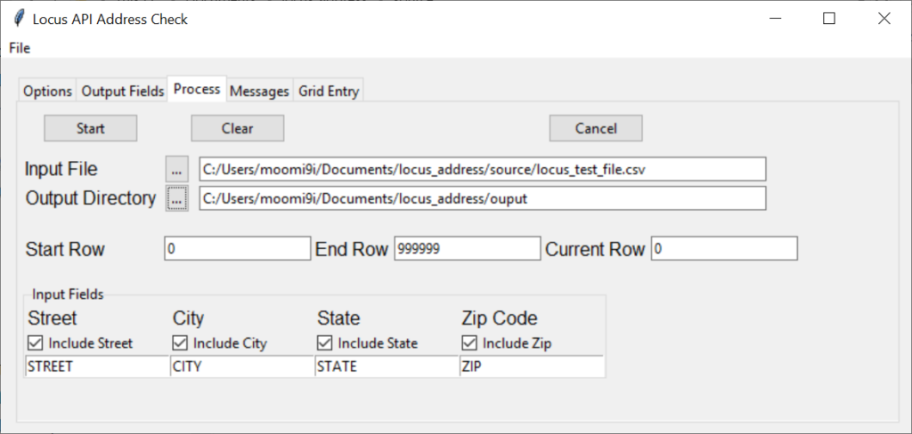
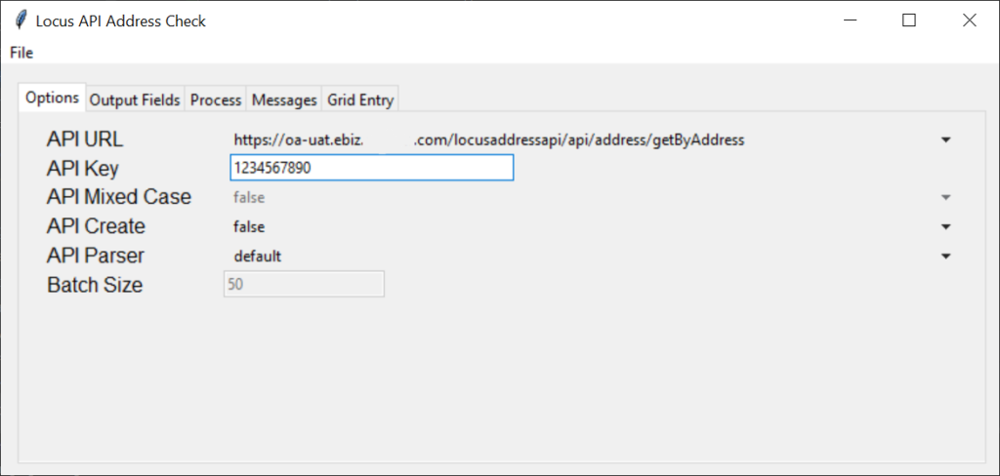
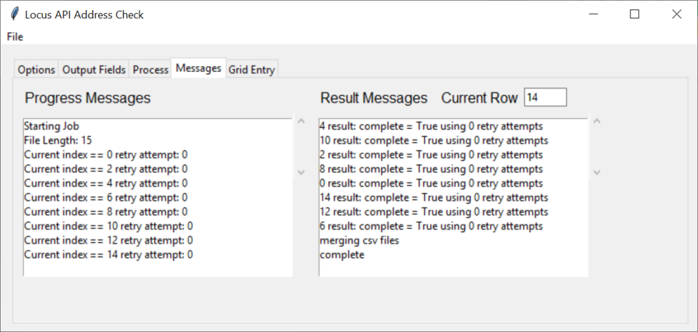

# Address Verification API


Where do you live? May be a simple question, but when companies are asking where someone lives, the answer isn't always so easy. The physical address and the mailing address of a person can be two completely separate things. And when companies want to send direct mail, they need to ensure the message is appropriate.

Today I am going to show a Python program that I wrote that can process millions of addresses and verify if the address is a valid mailing address that matches the physical address. And how the majority of online mapping services get it wrong.

<!--more-->

One the main challenges about physical addresses is that you can't rely on online mapping services for 100% verification. Many of the top mapping services, i.e. Google Maps, will approximate an address if it isn't in its database. An example of this is 1500 West Pine Street, Anywhere, AK. If Google Maps knows the street and the city, it will mark the location as the closest street number to the requested street number.

The result may be close enough for driving directions or to help give you an estimate of where the location is, but for the postal system, this doesn't work. If the building does exist, it is ok; however if it doesn't exist, then your mail will be returned. And a marketing opportunity will have been lost.

The United States Postal Service does have an address verification tool. However it doesn't allow for large datasets to be verified. Many of the other online API tools, paid or unpaid are the same. I resolved the issue by splitting the source file into manageable block sizes for requests. Next when the response is received I combine the responses and re-arrange the responses to match the order the requests were made.

The program uses concurrent futures package to allow for multi-threaded operations and allow for numerous requests to be sent and received at the same time.

## Program Overview

The program uses the tkinter UI package. I won't go in-depth on how the tkinter package works, that would be a separate posting all on its own. This post will be long enough as it is.



## Program Files

| File Name | Description |
| --- | --- |
| LocusApiSearch.py | The main file imports the packages and contains the main program loop |
| cls/apiHandler.py | class to handle connecting to the API |
| cls/csvFileHandler.py | creates interim .csv files and |
| cls/outputFile.py | defines the definition, i.e. colums of the output file |
| cls/pyUtilities.py | helper function to merge interim .csv files into the final file |
| cls/runtimeParameters.py | class to store user parameters from the UI |
| cls/ui.py | main class for handling the UI components |
| cls/uiConfig.py | reading configuration options from the UI and saving to local file |
| cls/userAddresses.py | definition of the input data file and methods to clean data |
|  |  |

## Packages

- datetime
- time
- os
- pathlib
- numpy
- pandas
- json
- requests
- tkinter
- concurrent.futures

## Program Flow

```
LocusApiSearch
   Initiate the UI
      Read the configuration settings, populate the UI
      Configuration settings file, doesn't exist use default

   Start the Main Loop
      Load the runtime parameters from the UI
      Initiate the log file
      Read the input file, store into a data frame
      Start new threads, each handling a block of data
      Process the csv file
          prep the data, based on parser and UI options
          save json file
      Make API call
          Process returned json file
          If file not processed, sleep, then retry
          Save file as .csv file
      Momentary pause, don't overload remote api
      Merge all .csv files
```

## Main

LocusApiSearch.py

```
# main entry point to start the gui
if __name__ == '__main__':
    # load the gui
    root = tk.Tk()
    app = Application(app_root=root)
    # start the gui
    app.mainloop()
    print("complete")
```

The first code block starts the UI, I assigned the UI to root. and assigned the application to app. Next I tell the UI to start the main loop.

## UI



I am going to skip over the UI startup and drawing. There are multiple tutorials on how to use the tkinter UI package for Python. In summary cls/ui.py and cls/uiConfig.py handle drawing the screen windows and controls in the UI.

## Application Start

### LocusApiSearch.py

#### start\_job()

```
def start_job(user_args: dict):
    """f(x) to initiate & control the API request threads"""
    try:
        global logfile

        # execution
        app.update_progress("Starting Job")

        # --------------------------------------------------------------------
        # set the run time parameters
        # --------------------------------------------------------------------
        args = runtimeParameters(user_args, batch=True)

        # --------------------------------------------------------------------
        # check and set logfile locale, write log file to results directory
        # --------------------------------------------------------------------
        log_path = Path(args.usr_args['output_dir'] + '/logs/')
        if not log_path.is_dir():
            os.mkdir(log_path)
        nm = logfile.name
        logfile = Path(log_path / nm)

        with open(logfile, 'a+') as file_handle:
            file_handle.write("starting job: " + datetime.now().strftime("%Y-%m-%d.%H%M%S") + "\n")
            file_handle.close()
```

start\_job(user\_args: dict)

Pass in the dictionary that was generated from reading contents of the UI.

Next, use the runtimeParameters class to organize the parameters. Because we are using multi-threaded processing need to have a local copy of the parameters for the current batch of data that is being processed.

The next thing is store into the log file that starting the job, and release the lock on the file.

```
        # initiate file handler to read the input file
        cfh = csvFileHandler(args.usr_args)

        # load the .csv file into a panda data frame
        # rm # cfh.get_file(args.csv_file_name, args.test_mode)
        cfh.get_file(csv_file_name=args.usr_args['input_file'])
        app.update_progress(f"File Length: {len(cfh.csv_df)}")

        # set the run time argument for file size
        # and starting rows, ending rows, and rows to process in batch
        args.set_file_length(len(cfh.csv_df))
```

Will use the csvFileHandler class to read the data file. Write a message to the UI to the let user know where we are in the processing. Update the args.set\_file\_length property with the file length.

### Initiate the Thread Pool

```
        # multi thread the process_csv_file f(x)
        # to initiate multiple threads
        # loop through input source document in groups specified by step size
        with cf.ThreadPoolExecutor(max_workers=8) as executor:
            call_locus_api = {executor.submit(process_csv_file, args, cfh, curr_idx):
                             curr_idx for curr_idx in np.arange(args.start_row, args.end_row, args.step_size)}
            for worker in cf.as_completed(call_locus_api):
                # stop new threads from being processed,
                # won't prevent existing results from being processed
                if app.continue_processing == False:
                    executor.shutdown(wait=False)
                    worker.cancel()
                    break
                
                fx_result = call_locus_api[worker]
                try:
                    worker_result = worker.result()
                except Exception as e:
                    print(f"Exception {e}")
                    app.update_progress(f"{fx_result} raised an exception {e}")
                else:
                    app.update_result(f"{fx_result} result: {worker_result}")
```

Here we will start processing the blocks of data. Each block of data will be assigned its own thread. I capped the maximum number of threads at 8. The number of threads could be set in the UI, but I opted against it.

```
with cf.ThreadPoolExecutor(max_workers=8) as executor:
```

cf is from the concurrent.futures package and the method ThreadPoolExecutor is what is used to manage the pool of threads.

```
call_locus_api = {executor.submit(process_csv_file, args, cfh, curr_idx):
                             curr_idx for curr_idx in np.arange(args.start_row, args.end_row, args.step_size)}
```

call\_locus\_api is definition of the function I want to execute with all of the applicable parameters.

```
for worker in cf.as_completed(call_locus_api):
                # stop new threads from being processed,
                # won't prevent existing results from being processed
                if app.continue_processing == False:
                    executor.shutdown(wait=False)
                    worker.cancel()
                    break
```

Use a for loop to process each data block. I do a quick check to see if the cancel button was pushed to prevent the data block from processing. Threads that are currently processing will finish.

```
                
                fx_result = call_locus_api[worker]
                try:
                    worker_result = worker.result()
                except Exception as e:
                    print(f"Exception {e}")
                    app.update_progress(f"{fx_result} raised an exception {e}")
                else:
                    app.update_result(f"{fx_result} result: {worker_result}")
```

fx\_result = call\_locus\_api\[worker\]

Now send the request out to the remote API, using the function that was defined for call\_locus\_api. Explanation of the [process\_csv\_file](#process_csv_file) function below.

Use a try / except block to handle any errors incurred from the calling the API. If the API results are successful notify the user in the result messages window. If an error was raised, notify the user in the progress window.



### LocusApiSearch.py

#### process\_csv\_file()

```
def process_csv_file(args: runtimeParameters
                     , cfh: csvFileHandler
                     , cidx: int):
    """function to do the locus API calls"""
    # counter to track requests sent to api
    max_tries = 4
    current_index = cidx

    # start retry loop
    for retry_attempts in range(max_tries):
        if app.continue_processing == False:
            return
        # write status to gui window
        app.update_progress(f"Current index == {current_index} retry attempt: {retry_attempts}")
        app.update_row(f"{str(current_index)}")

```

Pass the parameters needed to call the API. Hard coded the maximum retry attempts to 4. My remote API's are highly reliable, if the block fails four time most likely there is an issue with the data vs the API not working.

Do a quick check to ensure the user didn't click the cancel button, and if so continue on. Print messages to the progress messages window.

```
        # don't reset / re-run if there was an error
        if retry_attempts == 0:
            # prep the user addresses
            # df_curr is the current data frame range to process
            df_curr = cfh.csv_df.iloc[current_index:(current_index + args.step_size)]

            usr_addr = userAddresses(raw_df=df_curr, args=args)
            usr_addr.selectDataColumns()
            usr_addr.prepAddressess()
            usr_addr.populateAddresses()
            # --- DEBUG --- view the json formatted addresses
            # print(usr_addr.json_addresses)
            # --- LOG -- json request
            # append to file, + if file not there create
            with open(logfile, 'a+') as file_handle:
                file_handle.write(usr_addr.json_addresses + "\n")
                file_handle.close()
```

If it is the first attempt with the data block, will prep the data using the userAddresses class.

```
df_curr = cfh.csv_df.iloc[current_index:(current_index + args.step_size)]
```

Take a subset of the data from the data frame.

```
usr_addr = userAddresses(raw_df=df_curr, args=args)
            usr_addr.selectDataColumns()
            usr_addr.prepAddressess()
            usr_addr.populateAddresses()
```

The userAddresses class to select the appropriate columns from the input data set, cleanse the address and create a json file to send to the API.

```
            # make API calls
            api = apiHandler(api_url=args.usr_args['api_url']
                             , api_key=args.usr_args['api_key'])

        api.sendRequest(usr_addr.json_addresses)

        # initiate the output file handler
        outf = outputFile(file_len=args.file_length
                          , output_path=args.csv_output_path)
        outf.parse_file(current_index, api.json_response
                        , df_curr, df_curr['uid'].tolist())

```

Use the apiHandler class for each different api that will reference.

```
api.sendRequest(usr_addr.json_addresses)
```

Send the request to the api.

```
# initiate the output file handler
        outf = outputFile(file_len=args.file_length
                          , output_path=args.csv_output_path)
        outf.parse_file(current_index, api.json_response
                        , df_curr, df_curr['uid'].tolist())
```

Get the response from the API, parse the json file.

```
        if outf.success == True:
            # exit the loop
            break
        else:
            # sleep between retries to see if retry will work
            time.sleep(1.5)

    # exit the for loop
    args.current_index = args.current_index + args.step_size

    # compose result message
    result_msg = f"complete = {str(outf.success)} using {str(retry_attempts)} retry attempts"

    # implicity destroy local var to help with gc
    outf = None
    usr_addr = None
    api = None
    df_j = None
    r_val = None
    df_v = None
    df_output = None

    # momentary pause don't over load address API
    time.sleep(0.5)
    return result_msg
```

If the response is successful break out of the retry loop. And update the result message window. If the try failed, go to sleep for 1,5 seconds to not overload the remote API.

Even if successful will rate limit requests to the remote API by going to sleep for 0,5 seconds.
