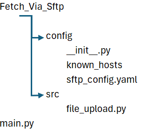

# Connect to sFTP


sFTP is still used on a daily basis. Many times the simpler well proven technologies just do the job, just like a hammer. Today's post will show how to use Python to connect to an sFTP site and securely upload or download your files.

* * *

Many times on [stackoverflow](https://stackoverflow.com/) you tend to get incomplete or partial samples of code that don't explain step by step what you need to do. And with sFTP every step is critical. The code presented is not production ready; i.e. no [Exception](https://docs.python.org/3/library/exceptions.html) blocks but it wouldn't take much more effort to adapt the code to be production ready. Instead we will concentrate on the important parts and get you downloading files quickly. Let's go!

* * *

1. [Directory Structure](#gce040e20b33f)
2. [main.py](#g3827cd31069d)
3. [Configuration File](#config_file)
4. [sftp\_config.yaml](#gc8c3c156f2e4)
5. [config](#sftp_config)
6. [File: \_\_init\_\_.py](#gf392a9f6177b)
7. [File: file\_upload.py](#g57eb7d384019)
8. [\_\_set\_file\_paths](#g9cdcc8c350c2)
9. [\_\_connect\_client](#g74b9e8588af7)
10. [known\_hosts file](#known_hosts)
11. [send\_files](#g455b0787e4be)

* * *

## Directory Structure

The directory structure will look like the following:



* * *

## main.py

This is the file we will invoke to start the program. It is rather simple.

```
# -- LIBRARY -----------------------------------------------------------------
import sys

# -- LOCAL FILES -------------------------------------------------------------
from src.file_upload import FileUpload

def main(argv) -> None:
    
    file_list = ['file_one.txt', 'file_two.txt']
    
    # upload files to sftp
    if len(file_list) > 0:
        fp = FileUpload()
        fp.send_files(file_list=file_list)


# Start the program
if __name__ == '__main__':
    main(sys.argv[1:])
```

```
# -- LIBRARY -----------------------------------------------------------------
import sys

# -- LOCAL FILES -------------------------------------------------------------
from src.file_upload import FileUpload

def main(argv) -> None:
    
    file_list = ['file_one.txt', 'file_two.txt']
    
    # upload files to sftp
    if len(file_list) > 0:
        fp = FileUpload()
        fp.send_files(file_list=file_list)


# Start the program
if __name__ == '__main__':
    main(sys.argv[1:])
```

The file is using the sys.argv\[1:\] to allow you to pass in arguments when you are running the program. In an effort to keep focus, we won't being using arguments, and will just hard code the file names in the main function.

Now let's go line by line.

```
# -- LIBRARY -----------------------------------------------------------------
import sys

# -- LOCAL FILES -------------------------------------------------------------
from src.file_upload import FileUpload

def main(argv) -> None:
    
    file_list = ['file_one.txt', 'file_two.txt']
    
    # upload files to sftp
    if len(file_list) > 0:
        fp = FileUpload()
        fp.send_files(file_list=file_list)


# Start the program
if __name__ == '__main__':
    main(sys.argv[1:])
```

This is the FileUpload class we will create later.

```
# -- LIBRARY -----------------------------------------------------------------
import sys

# -- LOCAL FILES -------------------------------------------------------------
from src.file_upload import FileUpload

def main(argv) -> None:
    
    file_list = ['file_one.txt', 'file_two.txt']
    
    # upload files to sftp
    if len(file_list) > 0:
        fp = FileUpload()
        fp.send_files(file_list=file_list)


# Start the program
if __name__ == '__main__':
    main(sys.argv[1:])
```

The main function, pretty simple isn't it?

file\_list is a list of files we will upload to the sFTP server. Conversely you could have a list of files you wish to download.

Next we check if the file\_list has any values in it; in case the list is being passed in via sys.argv.

Next we assign fp to the FileUpload class

Last step is we send the files, by calling the send\_files method in the class.

## Configuration File

In the configuration directory we have three files.

1. \_\_init\_\_.py

3. [known\_hosts](#known_hosts)

5. sftp\_config.yaml

We are going to look at the sftp\_config.yaml configuration file and the \_\_init\_\_.py file first. We will come back to the [known\_hosts](#known_hosts) file later on.

* * *

## sftp\_config.yaml

The configuration file will store the details on how to connect to the sFTP server and what files we want to upload.

```
# ----------------------------------------------------------------------------
# SFTP CONFIGURATION OPTIONS
# ----------------------------------------------------------------------------
# sftp connection values
---
SERVER:
  HOSTNAME: 'THESFTP-SERVER'
  USERNAME: 'myusername'
  KEY_FILENAME: 'C:\\Users\\my_name\\.ssh\\thekey.pem'
  KNOWN_HOSTS: '/config/known_hosts'

FILE:
  LOCAL_DIRECTORY:  'main/assets/'
  REMOTE_DIRECTORY: '/home/username/directory/directory/main/assets/'

FILE_NAMES:
  ONE:      'image_one.png'
  TWO:      'image_two.png'
  THREE:    'image_three.png'

WAIT_PERIOD: &waitperiod "10"
```

The configuration file is in plain text, the values are pretty self-explanatory. We will talk about the KEY\_FILENAME and [KNOWN\_HOSTS](#known_hosts) later on.

Make sure to specify your details, including HOSTNAME, USERNAME, LOCAL\_DIRECTORY, REMOTE\_DIRECTORY, etc...

* * *

## config

The init file will be used to load the .yaml configuration file. It is handy way of being able to store the sFTP configuration parameters without having to change the main parts of the code.

```
import pathlib, sys
from box import Box
```

We need three libraries the standard pathlib and sys, Additionally I use [python-box](https://pypi.org/project/python-box/) to help referencing values in the configuration. Python-box has a dependency on yaml parser. I use ruamel, finding it easier and quicker.

If not already installed, from your command line you can use pip to install them.

```
pip install python-box
pip install ruamel.yaml
```

* * *

## File: \_\_init\_\_.py

```
# ----------------------------------------------------------------------------
# load configuration
# ----------------------------------------------------------------------------
def load_config(file_name: str) -> Box:
    path = pathlib.Path(__file__).parent / file_name
    try: 
        with path.open(mode="r") as config_file:
            return Box(frozen_box=True).from_yaml(config_file.read())

    except FileNotFoundError as e:
        print(f"The directory {path.name} does not exist \n\n {e}")
        sys.exit(1)
    except PermissionError as e:
        print(f"Permission denied to access the directory {path.name}\n\n {e}")
        sys.exit(1)
    except OSError as e:
        print(f"An OS error occurred: {e}")
        sys.exit(1)

    finally:
        path = None
```

The function load\_config will take a file name as an argument and return the python-box object.

Next we get the path of the file and store it in the path variable.

```
    try: 
        with path.open(mode="r") as config_file:
            return Box(frozen_box=True).from_yaml(config_file.read())
```

Now we will open the file, and convert the .yaml file into a Box object to be used by the FileUpload class later on.

```
sftp_config:Box     = load_config("sftp_config.yaml")
```

And last step, we call the load\_config function.

* * *

## File: file\_upload.py

The FileUpload class will be used to connect to the sFTP server and than upload files. Additional methods could be added to download files, I will leave that exercise to you.

I am going to use the [paramiko](https://www.paramiko.org/) package. Again if not installed, from the command line use pip to install.

```
pip install paramiko
```

```
# -- LIBRARY -----------------------------------------------------------------
import os
from pathlib import Path

import paramiko as pa

# -- LOCAL FILES -------------------------------------------------------------
from config import sftp_config

class FileUpload():
    def __init__(self) -> None:
        self._file_list: list = None
        self._ssh_client: pa.SSHClient = None
        self._sftp_client: pa.SFTPClient = None
        self._known_hosts_file_path: Path = None

        # set the file paths
        self.__set_file_paths()

    def __set_file_paths(self) -> None:
        self._known_hosts_file_path = os.path.normpath("".join([os.getcwd(),sftp_config.SERVER.KNOWN_HOSTS]))

        if os.path.isfile(self._known_hosts_file_path) == False:
            raise Exception(f"Known_Hosts file can't be found: {self._known_hosts_file_path}")


    def __connect_client(self) -> None:
        
        # get the ssh key
        sftp_key = pa.RSAKey.from_private_key_file(sftp_config.SERVER.KEY_FILENAME)

        # set the ssh client
        self._ssh_client = pa.SSHClient()

        self._ssh_client.load_host_keys(self._known_hosts_file_path)

        # connect to server
        self._ssh_client.connect(hostname=sftp_config.SERVER.HOSTNAME,
                                 username=sftp_config.SERVER.USERNAME,
                                 pkey=sftp_key)


    def send_files(self, file_list:list) -> None:

        # connect to ssh client
        self.__connect_client()
               
        # init the sftp client
        self._sftp_client = self._ssh_client.open_sftp()

        self._sftp_client.chdir(sftp_config.FILE.REMOTE_DIRECTORY)
        
        # cycle through each file and put them on server
        for file in file_list:
            local_file_path = os.path.join(file)
            remote_file_path = "".join([sftp_config.FILE.REMOTE_DIRECTORY, os.path.basename(file)])
            try:
                self._sftp_client.put(localpath=local_file_path,
                                      remotepath=remote_file_path)
            
            except FileNotFoundError as err:
                print(f"File {local_file_path} not found locally")
        
        self._sftp_client.close()
        self._ssh_client.close()

```

```
# -- LIBRARY -----------------------------------------------------------------
import os
from pathlib import Path

import paramiko as pa

# -- LOCAL FILES -------------------------------------------------------------
from config import sftp_config
```

Here we will import in standard libraries and the [sftp\_config](#sftp_config) file we created earlier.

```
class FileUpload():
    def __init__(self) -> None:
        self._file_list: list = None
        self._ssh_client: pa.SSHClient = None
        self._sftp_client: pa.SFTPClient = None
        self._known_hosts_file_path: Path = None

        # set the file paths
        self.__set_file_paths()
```

Here we are defining the class, and setting some variables to hold, the ssh client, sftp client, and known\_hosts file\_path.

## \_\_set\_file\_paths

```
    def __set_file_paths(self) -> None:
        self._known_hosts_file_path = os.path.normpath("".join([os.getcwd(),sftp_config.SERVER.KNOWN_HOSTS]))

        if os.path.isfile(self._known_hosts_file_path) == False:
            raise Exception(f"Known_Hosts file can't be found: {self._known_hosts_file_path}")
```

Now we will read the contents of the [known\_hosts](#known_hosts) file. If the file doesn't exist, we will raise an Exception.

## \_\_connect\_client

When we connect to the ssh server, we will need a key. The user private key should be stored locally on your server. The key needs to be in the .pem file format. The private key should be created on the ssh\_server or ask the ssh server's admin to send one to you.

```
$ ssh-keygen -b 4096
$ cat .ssh/id_rsa.pub >> .ssh/authorized_keys

```

Then copy the .pem file to your local machine via [FileZilla](https://filezilla-project.org/) or another sftp tool.

```
    def __connect_client(self) -> None:
        
        # get the ssh key
        sftp_key = pa.RSAKey.from_private_key_file(sftp_config.SERVER.KEY_FILENAME)

        # set the ssh client
        self._ssh_client = pa.SSHClient()

        self._ssh_client.load_host_keys(self._known_hosts_file_path)

        # connect to server
        self._ssh_client.connect(hostname=sftp_config.SERVER.HOSTNAME,
                                 username=sftp_config.SERVER.USERNAME,
                                 pkey=sftp_key)
```

We use paramiko function to read the key from the file.

Next we connect to the client and store the client object in self.\_ssh\_client.

Know we need to load a list of known hosts to avoid a connection error.

Lastly we connect to the ssh server.

* * *

## known\_hosts file

One of the more difficult issues I saw with using the paramiko package was many folks were struggling with the error generated when there was not a known hosts file. Often the "solution" proposed by others was to use following line of code.

```
# auto add to known hosts
self._ssh_client.set_missing_host_key_policy(pa.AutoAddPolicy())
```

Using the option will leave you open to man-in-the-middle attacks. The proper way is to use a known\_hosts file.

The file is a simple text file, with no file extension. You can have one if you want but... why?

Your known\_hosts file should look like the following.

```
MYSERVER-ONE ssh-rsa AAAAB3NzaC.....=
MYSERVER-ONE ecdsa-sha2-nistp256 AAAAE2VjZHN.....=
MYSERVER-ONE ssh-ed25519 AAAAC3.../O
```

With the "...." replaced with many more characters. You should get the known hosts from the ssh server admin. However you can generate it if you are positive it is secure.

```
$ ssh-keyscan MYSERVER-ONE
```

* * *

## send\_files

Here is the method for sending the files.

```
    def send_files(self, file_list:list) -> None:

        # connect to ssh client
        self.__connect_client()
               
        # init the sftp client
        self._sftp_client = self._ssh_client.open_sftp()

        self._sftp_client.chdir(sftp_config.FILE.REMOTE_DIRECTORY)
        
        # cycle through each file and put them on server
        for file in file_list:
            local_file_path = os.path.join(file)
            remote_file_path = "".join([sftp_config.FILE.REMOTE_DIRECTORY, os.path.basename(file)])
            try:
                self._sftp_client.put(localpath=local_file_path,
                                      remotepath=remote_file_path)
            
            except FileNotFoundError as err:
                print(f"File {local_file_path} not found locally")
        
        self._sftp_client.close()
        self._ssh_client.close()
```

```
        # connect to ssh client
        self.__connect_client()
               
        # init the sftp client
        self._sftp_client = self._ssh_client.open_sftp()

        self._sftp_client.chdir(sftp_config.FILE.REMOTE_DIRECTORY)
```

First call the private method to connect to the ssh\_client.

Next we set the sftp client object.

Next we change the directory to the remote directory we set in the [configuration file](#config_file) earlier.

```
        # cycle through each file and put them on server
        for file in file_list:
            local_file_path = os.path.join(file)
            remote_file_path = "".join([sftp_config.FILE.REMOTE_DIRECTORY, os.path.basename(file)])
            try:
                self._sftp_client.put(localpath=local_file_path,
                                      remotepath=remote_file_path)
            
            except FileNotFoundError as err:
                print(f"File {local_file_path} not found locally")
```

Now we have a simple loop, that will read the name of each file in the file\_list, and try to upload (PUT) the file to the sFTP server.

An exception will be raised if the local file path is invalid.

```
        self._sftp_client.close()
        self._ssh_client.close()
```

And at the end we close the sftp\_client and ssh\_client.

* * *

That's it. Connecting to an sFTP server.
